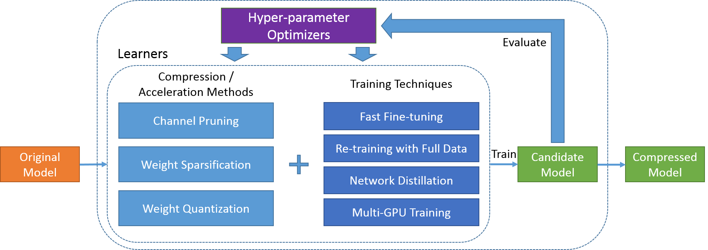

# PocketFlow

PocketFlow is an open-source framework for compressing and accelerating deep learning models with minimal human effort. Deep learning is widely used in various areas, such as computer vision, speech recognition, and natural language translation. However, deep learning models are often computational expensive, which limits further applications on mobile devices with limited computational resources.

PocketFlow aims at providing an easy-to-use toolkit for developers to improve the inference efficiency with little or no performance degradation. Developers only needs to specify the desired compression and/or acceleration ratios and then PocketFlow will automatically choose proper hyper-parameters to generate a highly efficient compressed model for deployment.

For full documentation, please refer to [PocketFlow's GitHub Pages](https://pocketflow.github.io/).

## Framework

The proposed framework mainly consists of two categories of algorithm components, \ie learners and hyper-parameter optimizers, as depicted in the figure below. Given an uncompressed original model, the learner module generates a candidate compressed model using some randomly chosen hyper-parameter combination. The candidate model's accuracy and computation efficiency is then evaluated and used by hyper-parameter optimizer module as the feedback signal to determine the next hyper-parameter combination to be explored by the learner module. After a few iterations, the best one of all the candidate models is output as the final compressed model.

## Learners

A learner refers to some model compression algorithm augmented with several training techniques as shown in the figure above. Below is a list of model compression algorithms supported in PocketFlow:

| Name | Description |
|:-----|:------------|
| `ChannelPrunedLearner`   | channel pruning with LASSO-based channel selection (He et al., 2017) |
| `DisChnPrunedLearner`    | discrimination-aware channel pruning (Zhuang et al., 2018) |
| `WeightSparseLearner`    | weight sparsification with dynamic pruning schedule (Zhu & Gupta, 2017) |
| `UniformQuantLearner`    | weight quantization with uniform reconstruction levels (Jacob et al., 2018) |
| `UniformQuantTFLearner`  | weight quantization with uniform reconstruction levels and TensorFlow APIs |
| `NonUniformQuantLearner` | weight quantization with non-uniform reconstruction levels (Han et al., 2016) |

All the above model compression algorithms can trained with fast fine-tuning, which is to directly derive a compressed model from the original one by applying either pruning masks or quantization functions. The resulting model can be fine-tuned with a few iterations to recover the accuracy to some extent. Alternatively, the compressed model can be re-trained with the full training data, which leads to higher accuracy but usually takes longer to complete.

To further reduce the compressed model's performance degradation, we adopt network distillation to augment its training process with an extra loss term, using the original uncompressed model's outputs as soft labels. Additionally, multi-GPU distributed training is enabled for all learners to speed-up the time-consuming training process.

## Hyper-parameter Optimizers

For model compression algorithms, there are several hyper-parameters that may have a large impact on the final compressed model's performance. It can be quite difficult to manually determine proper values for these hyper-parameters, especially for developers that are not very familiar with algorithm details. Recently, several AutoML systems, *e.g.* [Cloud AutoML](https://cloud.google.com/automl/) from Google, have been developed to train high-quality machine learning models with minimal human effort. Particularly, the AMC algorithm (He et al., 2018) presents promising results for adopting reinforcement learning for automated model compression with channel pruning and fine-grained pruning.

In PocketFlow, we introduce the hyper-parameter optimizer module to iteratively search for the optimal hyper-parameter setting. We provide several implementations of hyper-parameter optimizer, based on models including Gaussian Processes (GP, Mockus, 1975), Tree-structured Parzen Estimator (TPE, Bergstra et al., 2013), and Deterministic Deep Policy Gradients (DDPG, Lillicrap et al., 2016). The hyper-parameter setting is optimized through an iterative process. In each iteration, the hyper-parameter optimizer chooses a combination of hyper-parameter values, and the learner generates a candidate model with fast fast-tuning. The candidate model is evaluated to calculate the reward of the current hyper-parameter setting. After that, the hyper-parameter optimizer updates its model to improve its estimation on the hyper-parameter space. Finally, when the best candidate model (and corresponding hyper-parameter setting) is selected after some iterations, this model can be re-trained with full data to further reduce the performance loss.

## Reference

* [**Bergstra et al., 2013**] J. Bergstra, D. Yamins, and D. D. Cox. *Making a Science of Model Search: Hyperparameter Optimization in Hundreds of Dimensions for Vision Architectures*. In International Conference on Machine Learning (ICML), pages 115-123, Jun 2013.
* [**Han et al., 2016**] Song Han, Huizi Mao, and William J. Dally. *Deep Compression: Compressing Deep Neural Network with Pruning, Trained Quantization and Huffman Coding*. In International Conference on Learning Representations (ICLR), 2016.
* [**He et al., 2017**] Yihui He, Xiangyu Zhang, and Jian Sun. *Channel Pruning for Accelerating Very Deep Neural Networks*. In IEEE International Conference on Computer Vision (ICCV), pages 1389-1397, 2017.
* [**He et al., 2018**] Yihui He, Ji Lin, Zhijian Liu, Hanrui Wang, Li-Jia Li, and Song Han. *AMC: AutoML for Model Compression and Acceleration on Mobile Devices*. In European Conference on Computer Vision (ECCV), pages 784-800, 2018.
* [**Jacob et al., 2018**] Benoit Jacob, Skirmantas Kligys, Bo Chen, Menglong Zhu, Matthew Tang, Andrew Howard, Hartwig Adam, and Dmitry Kalenichenko. *Quantization and Training of Neural Networks for Efficient Integer-Arithmetic-Only Inference*. In IEEE Conference on Computer Vision and Pattern Recognition (CVPR), pages 2704-2713, 2018.
* [**Lillicrap et al., 2016**] Timothy P. Lillicrap, Jonathan J. Hunt, Alexander Pritzel, Nicolas Heess, Tom Erez, Yuval Tassa, David Silver, and Daan Wierstra. *Continuous Control with Deep Reinforcement Learning*. In International Conference on Learning Representations (ICLR), 2016.
* [**Mockus, 1975**] J. Mockus. *On Bayesian Methods for Seeking the Extremum*. In Optimization Techniques IFIP Technical Conference, pages 400-404, 1975.
* [**Zhu & Gupta, 2017**] Michael Zhu and Suyog Gupta. *To Prune, or Not to Prune: Exploring the Efficacy of Pruning for Model Compression*. CoRR, abs/1710.01878, 2017.
* [**Zhuang et al., 2018**] Zhuangwei Zhuang, Mingkui Tan, Bohan Zhuang, Jing Liu, Jiezhang Cao, Qingyao Wu, Junzhou Huang, and Jinhui Zhu. *Discrimination-aware Channel Pruning for Deep Neural Networks*. In Annual Conference on Neural Information Processing Systems (NIPS), 2018.
